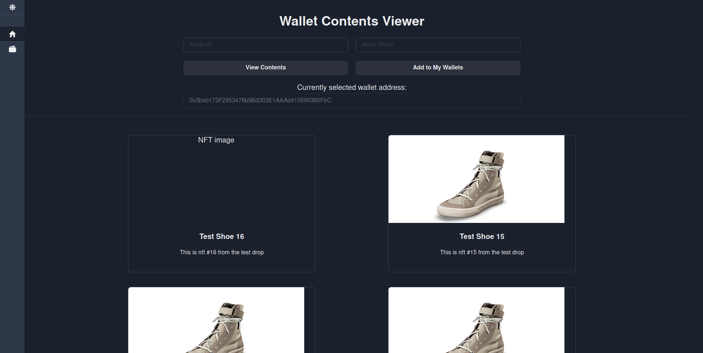
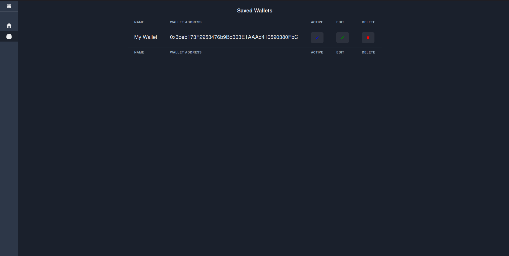

# Wallet Asset Viewer

A small created to test openseas API, Ngrok, and react patterns with hooks/providers. The goal is to view any testnet wallets nfts.

# How to install and run locally

- Git clone project 

```
$: git clone git@github.com:S-Brand5136/Wallet-Asset-Viewer.git
```

- Open a new terminal window and navigate to jsonServer diretory. Install dependencies and start the server

```
$: cd ./jsonServer && npm i && npm run db
```

- Go to [Ngroks website](https://ngrok.com/) and sign up for a free account. Follow their guide and run it on __the same port as your JSON Server__

- Open another terminal window and navigate to the frontend directory. Install all dependencies and start the server

```
$: cd ./frontend && npm i && npm run start
```

# Screenshots





# TODO

- Add memoization to react components